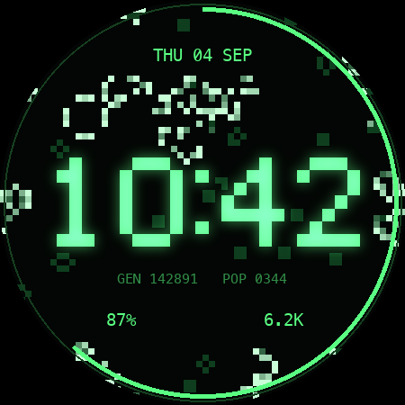

# GAME OF LIFE — a Wear OS watch face

Conway's Game of Life as the background of a watch face, with the time stamped
onto the same cell lattice the simulation runs on. Built for a Galaxy Watch 5
(Wear OS 4/5), structured after
[resonanse-cascade/hl-watchface](https://github.com/resonanse-cascade/hl-watchface).



## Install

Download the APK from [Releases](../../releases), then with the watch paired over
adb (Settings → About → Software info → tap Software version 7×, then Developer
options → ADB debugging + Wireless debugging):

```bash
adb install -r game-of-life-face.apk
```

Long-press the current face → swipe to **GAME OF LIFE** → tap. Or build it
yourself with `./build.sh --install` (needs the Android SDK and a JDK; Android
Studio ships one and `build.sh` finds it).

## What it does

- The time is drawn in a 5×7 pixel font **on the cell grid** — the numerals are
  made of the same cells as the simulation.
- Those cells, a one-cell halo, and the boxes the small type and complications
  occupy are held permanently dead. Without that mask the digits vanish into the
  churn within seconds.
- **On a minute roll the old time disperses**: the shell around the outgoing
  numerals is released into the board as live cells.
- **Tap the face** to drop an R-pentomino — chaotic for 1103 generations.
- A soup always decays into still lifes and oscillators, which on a watch face
  means a frozen picture. Each generation is hashed; when the board repeats
  itself or nearly dies out, fresh soup drops in.
- Newborn cells are brightest and fade as they survive, so motion reads.

## Customize (long-press → Customize)

| Setting | Options |
| --- | --- |
| Theme | Phosphor · Amber · Ice · Bone |
| Rule | Conway `B3/S23` · HighLife `B36/S23` · Maze `B3/S12345` · Seeds `B2/S` |
| Motion | Fast (15 fps) · Normal (5 fps) · Calm (2 fps) · Still |
| Slots | Top, Lower L, Lower R |

Each preset draws exactly one frame per generation: the only thing differing
between two frames of one generation is the seconds arc, so drawing several per
step repaints an identical board for nothing. The face has no background cost —
no sensors, services or wake locks — so those frames are its whole power budget.

## How it works

The grid is 64 columns because a row is then exactly one `Long`: a column shift
is a rotate, and that rotate *is* the torus wrap.

A generation is bit-plane arithmetic over whole rows. Horizontal 3-sums of the
rows above and below, plus the 2-sum of the row itself excluding its centre, are
added by a two-stage ripple adder into four planes holding the exact neighbour
count 0..8; testing "count == k" is then four ANDs. The whole 4096-cell board
costs ~1300 integer ops and no allocation. Counting *exactly* — rather than the
usual count-plus-self trick that only answers "is it 3 or 4" — is what allows
arbitrary `B/S` rules, and hence the rule selector.

Rendering matches: the board goes into a 64×64 pixel buffer blitted once with
filtering off, and the numerals' bloom is two dilations baked into a second
buffer once a minute, so nothing per-frame does a blur.

The core is plain Kotlin with no Android dependency, so `./gradlew
testDebugUnitTest` covers it — including a comparison against a naive per-cell
neighbour count over random boards, for every rule.

## Releases

Pushing a `v*` tag builds, tests and publishes the APK:

```bash
git tag v1.0 && git push origin v1.0
```

Without signing secrets that publishes a **debug** APK, signed with the runner's
throwaway key — installable, but its signature changes every build, so updating
means uninstalling first. For stable, upgradeable releases create a keystore once
and add it as repository secrets:

```bash
keytool -genkeypair -v -keystore release.jks -alias gol \
        -keyalg RSA -keysize 2048 -validity 10000
base64 -i release.jks | pbcopy          # -> KEYSTORE_BASE64
```

Add `KEYSTORE_BASE64`, `KEYSTORE_PASSWORD`, `KEY_ALIAS` and `KEY_PASSWORD` under
Settings → Secrets and variables → Actions. Keep `release.jks` out of the repo;
losing it means future releases can no longer upgrade an existing install.

## Notes

- Ambient mode is implemented but, on a Galaxy Watch 5 with always-on display
  off, never shown — on battery the screen simply powers down, and on the charger
  Samsung's own UI takes over. Verified on device.
- `tools/preview.py` renders the layout to a PNG on the desktop (Pillow). It is
  how the composition was designed, and it generates the preview drawable.
- No heart rate: Samsung Health will not feed a real BPM to a side-loaded face's
  complication, and reading it directly needs Health Services + `BODY_SENSORS`.
